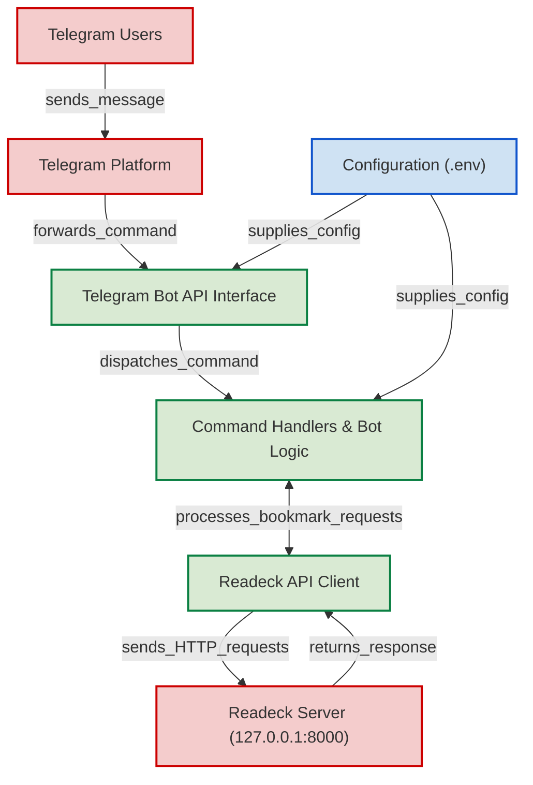

A Telegram bot that interfaces with a self-hosted [Readeck](https://readeck.org/) instance to manage bookmarks.
It's based on the [python-telegram-bot](https://python-telegram-bot.org/) framework.

Features:

- /register (create a new user) or /token to register the bot with an existent user
- Save bookmarks by sending a URL (with optional title and tags).
- Read. Create a simplified version of the article in telegra.ph
- /md_<id> return the raw markdown
- /list  . unread articles 
- /epub generate an epub with the unread articles


## Setup a development environment

**1. Clone the bot repository**

```bash
git clone https://github.com/mgaitan/readeckbot.git
cd readeckbot
```

**2. Download the Readeck binary**

Download the appropriate binary for your system from the official site: https://readeck.org/en/download

Place the `readeck` binary **in the same directory as the bot code**.  

**3. Start the Readeck API server in a console**

Open a terminal and run 

```bash
./readeck serve
```

or `readeck.exe serve` on Windows

This will start the Readeck backend on `http://127.0.0.1:8000` by default. 


**4. Set up your environment variables**

Create a file named `.env` in the project root. This file stores config variables used by the bot.

```env
TELEGRAM_BOT_TOKEN=<your_bot_token>
READECK_BASE_URL=http://127.0.0.1:8000
READECK_CONFIG=home/smething/config.toml      # optional, can be left out. Use the full path
READECK_DATA=home/something/data               # optional, use if you want to customize where data is stored. Use the full path

LLM_KEY=<your_llm_key>           # optional, use if you want to enable LLM features
LLM_MODEL=<model_name>           # optional, by default it's gemini-2.0-flash-lite
LLM_SUMMARY_MAX_LENGTH=<int>     # optional , use if you want to customize the max length of LLM summary
```

> 📄 What’s a `.env` file? It's a simple file format for storing key=value pairs, that are loaded as [environment variables](https://en.wikipedia.org/wiki/Environment_variable) by apps. 

> [!IMPORTANT]
> Keep in mind that, initially, **we will be working with two different 'tokens'**.
> 
> On one hand, there's the one we set in the `.env` file for the **Telegram bot**; on the other, there's the authentication **token specific to Readeck**.
> If you’re having issues when trying to use `/register`, it’s likely that you're missing the latter.
> 
> An easy way to resolve this is by going to the URL where you're hosting Readeck, then navigating to **Settings → API**.
> There you can generate the authentication token and then use it in the Telegram chat with the command `/token <your_readeck_token>`.

**5. Get your own Telegram bot token**

To connect your bot to Telegram, you’ll need to create a bot and get its API token.

- Open Telegram and message [@BotFather](https://t.me/botfather)
- Run `/newbot` and follow the prompts.
- Copy the token it gives you and paste it into your `.env` file under `TELEGRAM_BOT_TOKEN`

More info: https://core.telegram.org/bots#creating-a-new-bot

**6. Run the bot in development mode**

This project uses [`uv`](https://github.com/astral-sh/uv), a fast Python package manager and runner.

> Don't have it yet? Install it from here: https://github.com/astral-sh/uv#installation

Then in another terminal run the bot:

```bash
uv run --extra llm readeckbot
```

The first time it will install Python and the depenencies as needed and can take a bit, but 
that’s it! 

You can now start chatting with your bot on Telegram using your own token.


Happy hacking and happy reading! 📚🤖

## Architecture





(done with [gitdiagram](https://gitdiagram.com/mgaitan/readeckbot))
